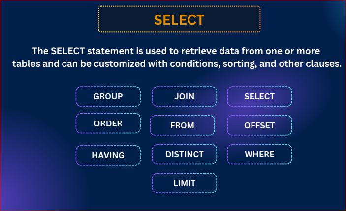

# postgresQL advanced data manipulaton teq
  slide link:https://drive.google.com/file/d/1s5VPi8b89d1zs8JvzWS_juDyB4-8kJF2/view

  In this module, we’ll dive into advanced data manipulation techniques in PostgreSQL. You’ll learn how to use ALTER for modifying tables and constraints, work with default values and column rules, and master filtering data using WHERE, AND, OR, BETWEEN, IN, LIKE, and ILIKE. We’ll also explore scalar functions and finish with powerful aggregate functions like COUNT, SUM, and AVG. By the end, you’ll be confident in writing more efficient and professional SQL queries.
## 45:1

- create a table 

```sql
create table employee (
  id serial,
  name varchar(50),
  age int
);
```
- change the table name 

```sql
alter table employees rename to employee
```

- add column 

```sql
alter table employee 
  add column email varchar(50)
  

```

- drop a column 

```sql
alter table employee 
  drop column email;
```

- rename a column name 

```sql
alter table employee
  rename column name to user_name;
```

- modify a data type 

```sql
alter table employee 
  alter column user_name type varchar(50) 
```

- add a new constrain to a column  

```sql
alter table employee 
  alter column email set not null
```

- drop a constrain

```sql
alter table employee 
  alter column email drop not null
```

## 45-2 ALTER Default Values & Column Constraints
- set default value 

```sql
alter table employee
  alter column email set default 'test@gmail.com'
```
- remove default 

```sql
alter table employee
  alter column email drop default
```

- add table level constrain 

```sql
alter table employee add constraint unique_employee_email unique(email)
```
```sql 
alter table employee 
  add constraint pk_employee_id primary key(id);
```

```sql
ALTER TABLE employee 
  ADD CONSTRAINT unique_employee_email UNIQUE (email, username);
```

- drop table level constraints 

```sql 
alter table employee 
  drop constraint unique_employee_email;
```

## 45-3 SELECT Basics: Sorting & Aliases

## USAGE OF SELECT 

- The SELECT statement is used to retrieve data from one or more tables and can be customized with conditions, sorting, and other clauses.



- make a student table 

```sql
create table students (
  student_id serial PRIMARY KEY,
  first_name varchar(50) not null,
  last_name varchar(50) not null,
  age int,
  grade char(2),
  course varchar(50),
  email varchar(100) unique, 
  dob date,
  blood_group varchar(5),
  country varchar(50)
)
```
- Insert data 

```sql
INSERT INTO students 
(first_name, last_name, age, grade, course, email, dob, blood_group, country) VALUES
('Dustin', 'Haas', 22, 'E', 'Chemistry', 'dustin.haas1@example.com', '2001-03-08', 'B-', 'Gibraltar'),
('Christine', 'Ramirez', 25, 'B', 'Economics', 'christine.ramirez2@example.com', '2003-12-13', 'O+', 'Nicaragua'),
('Kaitlyn', 'Mitchell', 20, 'B', 'History', 'kaitlyn.mitchell3@example.com', '2002-05-10', 'AB+', 'Dominican Republic'),
('Allen', 'Jones', 20, 'A', 'Physics', 'allen.jones4@example.com', '2004-08-29', 'O+', 'Central African Republic'),
('Michael', 'Fleming', 22, 'F', 'History', 'michael.fleming5@example.com', '2001-01-24', 'B-', 'Wallis and Futuna'),
('Kelly', 'Lee', 21, 'D', 'Chemistry', 'kelly.lee6@example.com', '2003-06-06', 'B+', 'Monaco'),
('Francis', 'Gibson', 24, 'A', 'Physics', 'francis.gibson7@example.com', '2000-07-19', 'A-', 'Sierra Leone'),
('Abigail', 'Paul', 19, 'D', 'Economics', 'abigail.paul8@example.com', '2004-07-14', 'O-', 'New Zealand'),
('Zachary', 'Evans', 23, 'C', 'Math', 'zachary.evans9@example.com', '2001-11-03', 'AB-', 'Brazil'),
('Laura', 'Cooper', 20, 'B', 'Biology', 'laura.cooper10@example.com', '2005-04-17', 'O+', 'Kenya'),
('Benjamin', 'Scott', 22, 'A', 'CS', 'benjamin.scott11@example.com', '2002-01-21', 'A+', 'Germany'),
('Samantha', 'Brooks', 19, 'C', 'Economics', 'samantha.brooks12@example.com', '2004-10-11', 'B-', 'Japan'),
('Ethan', 'Morris', 21, 'F', 'History', 'ethan.morris13@example.com', '2003-12-09', 'O-', 'Bangladesh'),
('Victoria', 'Bailey', 25, 'B', 'Math', 'victoria.bailey14@example.com', '2000-06-28', 'AB+', 'Canada'),
('Daniel', 'Clark', 23, 'D', 'Biology', 'daniel.clark15@example.com', '2001-08-16', 'A-', 'India'),
('Sofia', 'Turner', 20, 'B', 'CS', 'sofia.turner16@example.com', '2005-07-11', 'O+', 'Italy'),
('Jackson', 'Reed', 24, 'C', 'Physics', 'jackson.reed17@example.com', '2000-09-05', 'B+', 'Australia'),
('Liam', 'Walker', 21, 'A', 'Math', 'liam.walker18@example.com', '2002-02-23', 'O-', 'USA'),
('Olivia', 'Parker', 19, 'D', 'Biology', 'olivia.parker19@example.com', '2006-03-15', 'A+', 'Mexico'),
('Noah', 'Hughes', 23, 'B', 'Economics', 'noah.hughes20@example.com', '2001-10-20', 'AB-', 'France'),
('Ava', 'Ward', 22, 'F', 'History', 'ava.ward21@example.com', '2003-11-30', 'O+', 'Spain'),
('Mason', 'Carter', 20, 'C', 'Chemistry', 'mason.carter22@example.com', '2005-05-18', 'B-', 'South Korea'),
('Isabella', 'Wright', 21, 'B', 'CS', 'isabella.wright23@example.com', '2004-04-25', 'O-', 'China'),
('James', 'Green', 25, 'A', 'Math', 'james.green24@example.com', '2000-02-08', 'A-', 'Norway'),
('Mia', 'Adams', 23, 'D', 'Biology', 'mia.adams25@example.com', '2001-09-27', 'B+', 'Argentina'),
('Lucas', 'Nelson', 19, 'B', 'Physics', 'lucas.nelson26@example.com', '2006-01-14', 'AB+', 'Egypt'),
('Amelia', 'Baker', 22, 'C', 'Economics', 'amelia.baker27@example.com', '2003-12-02', 'O+', 'Russia'),
('Elijah', 'Hill', 20, 'F', 'History', 'elijah.hill28@example.com', '2005-03-22', 'O-', 'Greece'),
('Harper', 'Lopez', 21, 'B', 'CS', 'harper.lopez29@example.com', '2004-05-10', 'AB-', 'Portugal'),
('William', 'Allen', 24, 'A', 'Chemistry', 'william.allen30@example.com', '2000-08-03', 'A+', 'Turkey');
dsd
```

- show all data from the table 

```sql 
select * from students;
```

- show the first name 

```sql
select first_name from students;
```

- show first name and age 

```sql
select first_name, age from students;
```

- using column alias 

```sql 
select first_name as firstName from students;
```

```sql 
select first_name as "First Name" from students;
```
- remember we will use  "" double quotation while we are using for column single '' quotation for character 

```sql
select first_name as "First Name", age as "User Age" from students;
```

```sql 
select first_name, blood_group, country, age from students;
```
##  45-4 DISTINCT & WHERE Filtering

### SELECT WITH DISTINCT 

```SQL 
select  country from students;
```
- distinct i mean the unique country i want 

```sql

select distinct country from students;

```

```sql
select distinct course from students;
```

### WHERE FILTERING 
- select the students only from USA only 
```sql
select * from students 
  where country = 'USA';
```

```sql 
select first_name, age, course, country from students 
  where country = 'USA';
```

- select students who have got A  grade 

```sql
select * from students 
  where grade = 'A';
```

- where blood group is A+

```sql 
select * from students
  where blood_group = 'A+'
```
## 45-5 Filtering with AND & OR

### SELECT WITH OR OPERATOR 

- Select students from the USA or bangladesh 

```sql
  select * from students
    where country = 'USA' or country = 'Bangladesh';
```
- select students with a grade A or B  in Physics or CS 

```sql 
select * from students 
  where (grade = 'A' or grade = 'B') and (course = 'CS' or course ='Physics');
```

- select students from USA and Bangladesh and the age is 20 

```sql
select * from students 
  where (country = 'USA' or country = 'Bangladesh') and age =21;
```

## 45-6 Comparison, BETWEEN & IN
### SELECT with condition operator 

- find those students whose age is higher than equal 22

```sql
select * from students 
  where age >= 22;
```
- find the students who are not from USA

```sql 
select * from students 
  where country != 'USA';
```
```sql 
select * from students 
  where country <> 'USA';
```

### SELECT with BETWEEN OPERATOR

- select students whose age is between 20 and 22

```sql 
select * from students 
where age between 20 and 22;
```
### SELECT with IN OPERATOR
- select students from bangladesh, india, Spain 

```sql 
select * from students 
where country ='Bangladesh' or country ='USA' or country='Spain';
```

```sql
select * from students 
where country IN ('Bangladesh','USA','Spain');
```
- both are same and second one is shortcut 

- select students enrolled in 'Physics', 'CS', 'Biology'

```sql 
select * from students 
  where course in ('Physics', 'CS', 'Biology');
```

## 45-7 LIKE vs ILIKE

### LIKE 
- its used like search. Its like we do not know the exact value but we know the pattern 
- select students whose first name starts with A

```sql 
select * from students 
where first_name like 'A%'; -- here % means after A there might many value exists
```
```sql 
select * from students 
where first_name like '%A'; -- here % means before A there might many value exists
```

- find students where name starts with A and only 3 letter can exists after A

```sql 
select * from students 
where first_name like 'A___'; -- 3 _ _ _ means after A there will be 3 letter after A 
```
```sql 
select * from students 
where first_name like '%a_'; -- This means last letter will be a and after a there will be another letter 
```

#### `LIKE OPERATORIS CASE SENSITIVE`


## ILIKE operator - which is case insensitive

```sql
select * from students
 where email ILike 'A%'
```

- select students whose last name ends with n 

```sql 
select * from students
 where last_name ILike '%n';
```
## 45-8 NOT & Scalar Functions

### NOT operator - ist a operator for negation 
- select the students who are not from bangladesh 
```sql
select * from students 
where country != 'Bangladesh';
```

- doing the same using NOT 

```sql 
select * from students 
where NOT country = 'Bangladesh';
```
- select students whose grade is not A 

```sql 
select * from students 
where NOT grade = 'A';

```
### Functions 
#### Types of functions 
##### Scaler (`upper, lower, concat, length`)

- give me first_name in uppercase 

```sql 
select upper(first_name) from students;
```


- when we write the command it will go to the table and targeted column and run for each row it will run. This is scaler function. we will get one value for one row.. That means it will run for each row and give value. 

```sql 
select lower(first_name) from students;
```

```sql 
SELECT CONCAT(first_name, ' ', last_name) AS "Full Name" FROM students;

```

```sql 
SELECT length(first_name) as "first_name_length" FROM students;
```
```sql 
SELECT length(first_name) as "first_name_length" FROM students order by first_name_length asc;
```

##### Aggregate (`avg, max, min, sum, count`)


- aggregate will take all the values and give summarized data after processing. wil run for each row and will give us result
- aggregate function runs against whole table 

```sql 
select avg(age) as avg_age from students;
```
```sql 
select sum(age) from students;
```
```sql 
select count(first_name) from students;
```
```sql 
select count(*) from students;
```

```sql 
select max(age) as max_age from students;
```

```sql 
select min(age) as min_age from students;
```