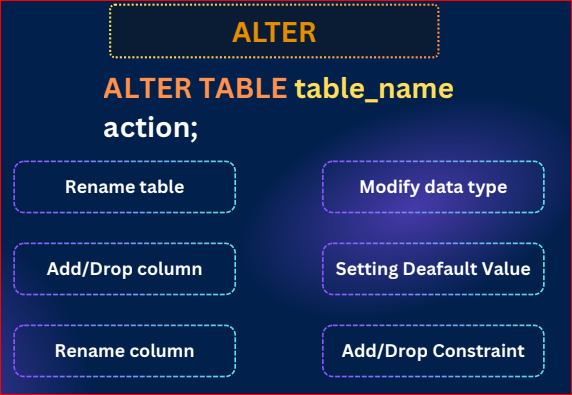

# postgresQL advanced data manipulaton teq
## 45:1

- create a table 

```sql
create table employee (
  id serial,
  name varchar(50),
  age int
);
```
- change the table name 

```sql
alter table employees rename to employee
```

- add column 

```sql
alter table employee 
  add column email varchar(50)
  

```

- drop a column 

```sql
alter table employee 
  drop column email;
```

- rename a column name 

```sql
alter table employee
  rename column name to user_name;
```

- modify a data type 

```sql
alter table employee 
  alter column user_name type varchar(50) 
```

- add a new constrain to a column  

```sql
alter table employee 
  alter column email set not null
```

- drop a constrain

```sql
alter table employee 
  alter column email drop not null
```